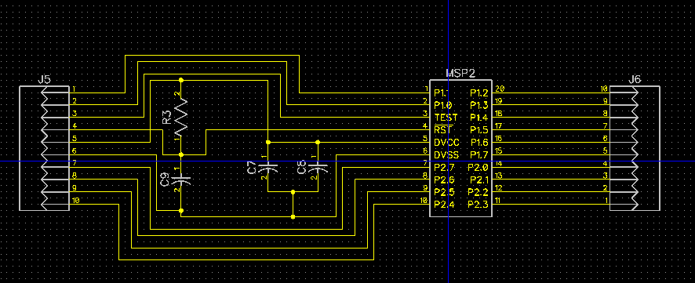
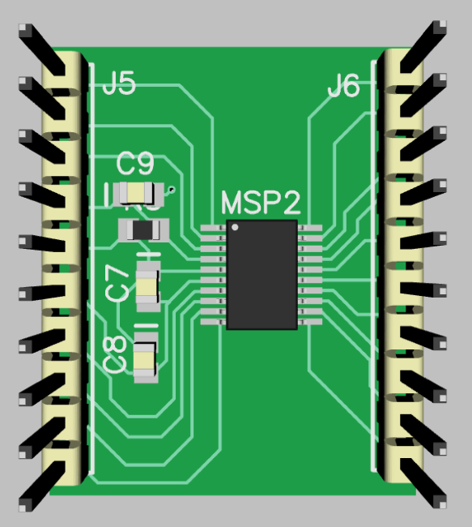

# PCB Breakout Board
## Schematic
In this lab a PCB breakout board with reset circuitry was designed. This circuit was drawn in the schematic editor in diptrace, then the pcb was designed with the PCB editor. Only one component had to be drawn in the component editor, this was the MSP430FR2311IPW20R. 


## PCB Design
The PCB was designed with reset circuitry, two headers, and a MSP430FR2311. The PCB dimensions are 1.1x0.9 inches. 



## ```Bill of Materials```
The README for this folder should also contain the Bill of Materials as well as (if possible) a link to a Digikey/Mouser cart that contains the parts you would want for this board.

## List of Files and Folders 
This folder should contain the following files:
* BOARD.sch
* BOARD.pcb
* Schematic.PNG
* PCB.PNG
* GERBERS (Folder)
